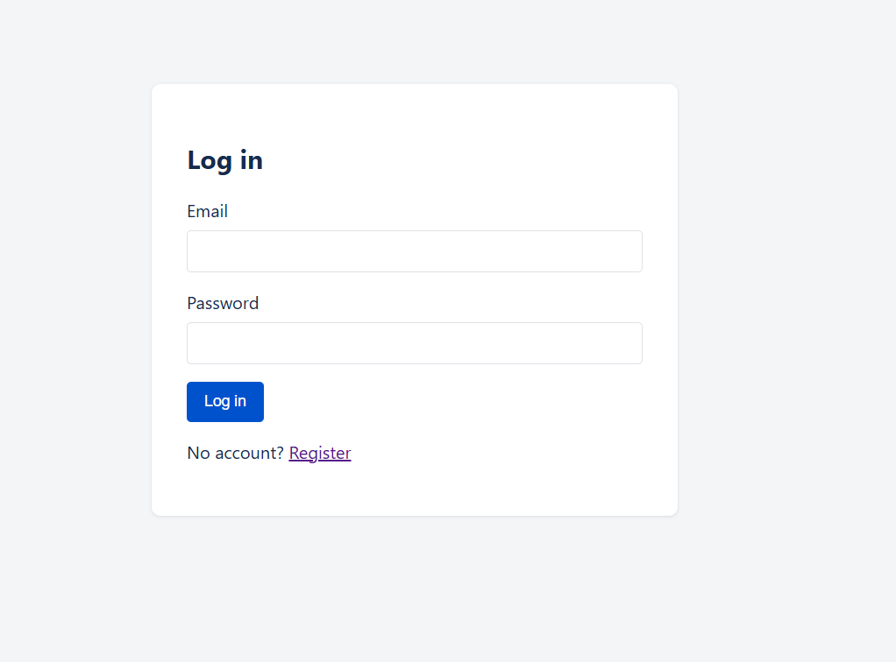
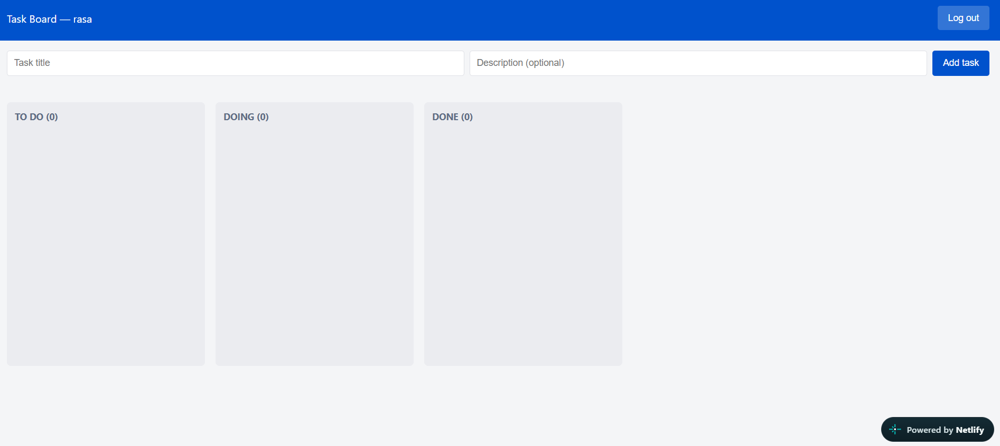
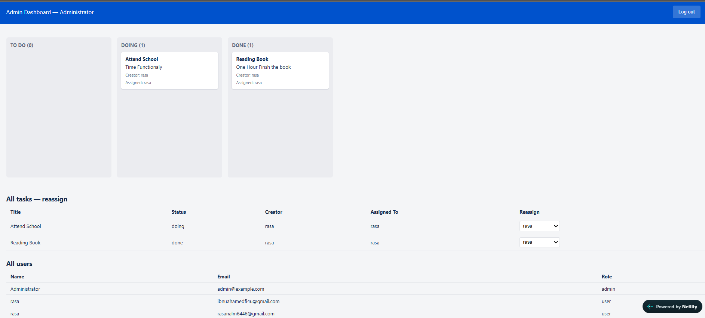

# Task Board — Frontend

Next.js frontend for the Trello-like task management app.

## Tech Stack
- **Framework**: Next.js (Pages Router) + React
- **Drag-and-drop**: @hello-pangea/dnd (maintained fork of react-beautiful-dnd)
- **HTTP client**: Axios
- **Auth**: JWT stored in `localStorage`, attached to requests via an Axios interceptor

## Project Structure
```
frontend/
  pages/
    index.js        # login
    register.js      # registration (normal users only)
    dashboard.js     # normal-user board
    admin.js         # admin board + reassignment tables
  components/
    Board.js, Column.js, TaskCard.js   # drag-and-drop board
  context/AuthContext.js               # auth state, login/register/logout
  lib/api.js                           # Axios instance
```

## Environment Variables
Copy `.env.local.example` to `.env.local`:

| Variable | Description |
|---|---|
| `NEXT_PUBLIC_API_URL` | Base URL of the deployed backend API, e.g. `https://your-api.onrender.com/api` |

## Setup
```bash
npm install
cp .env.local.example .env.local   # then edit it
npm run dev
```

## Features
- Login / register (registration always creates a normal user — admins are seeded on the backend)
- Drag-and-drop board with To Do / Doing / Done columns; drags persist via `PATCH /tasks/:id/status`
- Normal users can create tasks and claim unassigned ones ("Assign to me")
- Admin dashboard shows every task/user and lets admins reassign any task via a dropdown

## Deployment Notes
Deployed on [Vercel — fill in]. Set `NEXT_PUBLIC_API_URL` in the Vercel project's environment variables to the deployed backend URL.

## Screenshots

### Login


### User Dashboard


### Admin Dashboard
